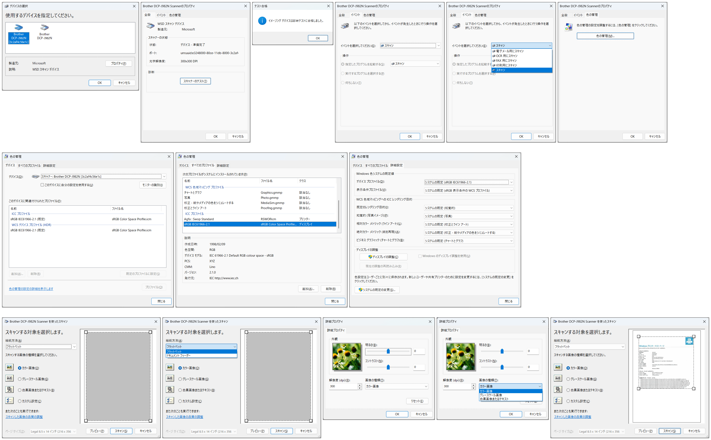

.. _wia:

WIA (Windows Image Acquisition)
===============================

概要
----

2026-02-01 年現在、 Windows 11 on Arm でも引き続きサポートが継続している、スキャナーの基盤技術です

WIA の使用例としては、 USB 接続のスキャナー装置 (複合機を含む) を使って紙の媒体をスキャンする、 画像化する、 というユースケースがあると思います

紙面を電子化する、という点では、ほかにも活用できる技術が複数あるため、 WIA はそれ程ユーザーが重要視しているようには感じませんが、あれば有り難いものです

複合機の活用:

* 複合機で紙面をスキャン (電子化) し
* 画像データ (JPG, PNG) や書類データ (PDF, TIF, XDW) 等として
* SMB / FTP 等のプロトコルを用いて
* Windows Server / NAS 等の共有フォルダーへデータを保管する

スマホの活用:

* スマホで直接、紙面を写真として撮影する
* その後、メールやビジネスチャットを経由して、データを送り届ける

また、 PFU の ScanSnap 製品など、 書類の電子化に特化したソリューション (ハードとソフトを組み合わせたもの) も多数、市場にはあります

WIA 対応アプリの例
---------------------------

Windows では、つぎのツールでスキャンができます:

* ペイント
* `Windows スキャン <https://apps.microsoft.com/detail/9wzdncrfj3pv?hl=ja-JP&gl=US>`__

弊社で開発した `jtifedit3 <https://github.com/HiraokaHyperTools/jtifedit3>`__ でも WIA スキャンが実行できます

WIA は WIA Automation Layer として API が公開されています。 COM (STA) です:

* `Windows Image Acquisition Automation Layer | Microsoft Learn <https://learn.microsoft.com/ja-jp/previous-versions/windows/desktop/wiaaut/-wiaaut-startpage>`__

WIA の良いところは:

- (今のところ) WIA 本体は OS に標準装備 (但し WIA ドライバーは別途必要)
- アプリのビット数とプラットフォーム (x86, x64, ARM64) に関係なく利用できる点
- アプリが対応していれば 1 度に複数枚スキャンができる点

スクショ
---------------------------

