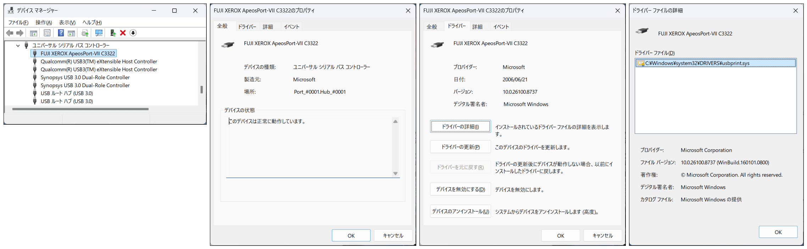
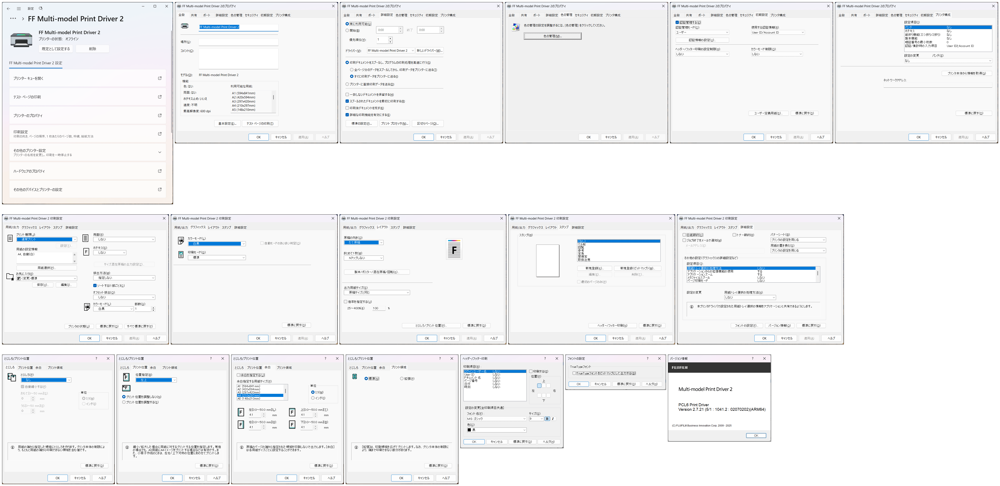

Fujifilm ApeosPort-VII C3322
============================

結果
----

以下の 2 種類のドライバーでテストしました。 接続方式は USB です (2026-06-28 現在)

.. list-table::
   :header-rows: 1

   * - ドライバー
     - 結果
   * - | Multi-model Print Driver 2（ARM64版）
       | 2025/12/5
       | Ver. 2.7.21
       | ``ffmmd2pcl6251160w11aiml.exe``
       | `ダウンロード <https://www.fujifilm.com/fb/ja/support/multifunction-printers/tool/download-01019>`__
     - | 可能。
       | 対応しています
   * - | FUJIFILM ART EXドライバー
       | （Microsoft WHQL認証取得ドライバー）
       | 2023/7/20
       | Ver. 6.13.2
       | ``ffap7c4422plw230610w646fml.exe``
       | `ダウンロード <https://www.fujifilm.com/fb/ja/support/multifunction-printers/color/download-00167>`__
     - | 不可。
       | インストール作業が完了せず

Multi-model Print Driver 2
--------------------------

デバイスマネージャー

プリンターのプロパティです

テスト印刷したものです

:download:`imgs/apeos-port-vii-c3322/test-page.png`
