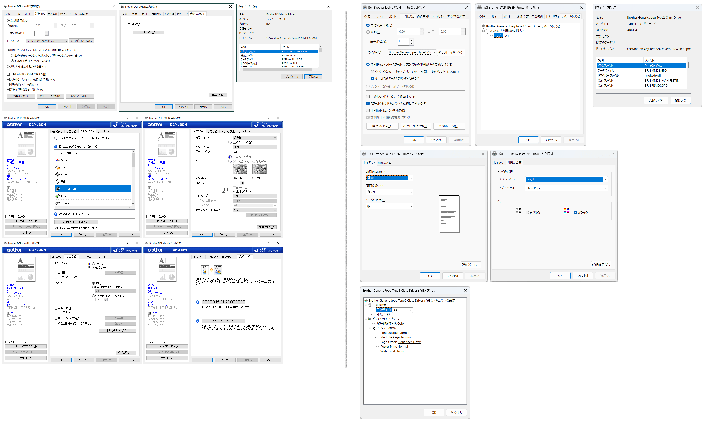

.. _dcp-j982n:

ブラザー DCP-J982N
=================================================

対応状況
-------------------------------------------------

セットアップは未対応です。

サイトに未対応との表記がありました。

- `【インクジェット/レーザー プリンター・スキャナー】Windows 11 ARM（Snapdragon）対応状況｜ブラザー <https://faq.brother.co.jp/app/answers/detail/a_id/12345/kw/arm/p/1>`_

.. pull-quote::

   OSに標準で含まれるドライバーで基本的な印刷機能をサポートします。

代替手段
-------------------------------------------------

代替手段があります。

LAN 接続
^^^^^^^^^^^^^^^^^^^^^^^^^^^^^^^^^^^^^^^^^^^^^^^^^

LAN で接続し ``Microsoft IPP Class Driver`` 対応プリンターとしてインストールする方法です。

``デバイスの追加`` で ``DCP_J987N_BRxxxx`` のように候補が表示されます。

これの右横にある ``デバイスの追加`` ボタンをクリックすると、インストールできます。

テスト印刷もできました。

USB 接続
^^^^^^^^^^^^^^^^^^^^^^^^^^^^^^^^^^^^^^^^^^^^^^^^^

USB 接続し、数分間待機していると、USB プリンターがインストールされました。

但し、接続した直後は、ドライバーがありません、使用できませんの状態でした。

こちらは USB 接続にも関わらず ``Microsoft IPP Class Driver`` プリンタードライバーが使用されていました。
``IPP over USB`` で接続されるようです。

テスト印刷もできました。

プリンタープロパティー画面の比較
-------------------------------------------------

x64 と ARM64

体験に満足したかどうか
-------------------------------------------------

Q. 本件に関して ``Copilot+ PC`` (Arm 版 Windows 11) 上の体験に満足しましたか、また、メイン PC を移行したいですか。

A. いいえ。未だ移行したくありません。

私の DCP-J982N のユースケースとして、つぎのようなものがあります:

- レジュメなどを A4 白黒・高速印刷しています
- カラーの書類を A4 カラー・高速印刷しています
- CD レーベルの印刷をしています

これらのユースケースを満たす事ができていません。メイン PC の移行は時期尚早と考えます。
