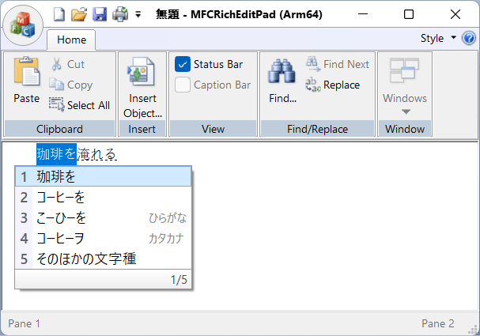
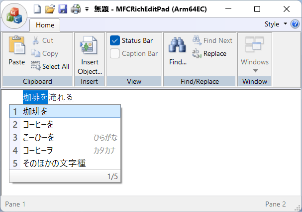

Mozc
====

2026-02-15 現在、対応している事を確認しました [#mozc_build]_

.. [#mozc_build] 確認したビルド: `Replace const vector& with appropriate alternatives. · google/mozc@a99841e <https://github.com/google/mozc/commit/a99841e37b7459d08e5736c3613a6bcd393c9e92>`__

サンプルアプリ MFCRichEditPad で評価しました。

- `HiraokaHyperTools/MFCRichEditPad <https://github.com/HiraokaHyperTools/MFCRichEditPad/>`__

x86 アプリで

.. image:: imgs/mozc/mozc-x86-fs8.png

x64 アプリで

.. image:: imgs/mozc/mozc-x64-fs8.png

Arm64 アプリで

Arm64EC アプリで

但し、 Mozc は公式バイナリーを提供していません。 GitHub レポジトリ `google/mozc: Mozc - a Japanese Input Method Editor designed for multi-platform <https://github.com/google/mozc>`__ で説明されているように、 OSS Mozc project には品質保証が伴わないため、 安定版という概念がない、 ということのようです:

.. pull-quote::

    As described in `About Branding <https://github.com/google/mozc/blob/master/docs/about_branding.md>`__ page, Google does not promise any official QA for OSS Mozc project. Because of this, Mozc does not have a concept of *Stable Release*. Instead we change version number every time when we introduce non-trivial change. If you are interested in packaging Mozc source code, or developing your own products based on Mozc, feel free to pick up any version. They should be equally stable (or equally unstable) in terms of no official QA process.

では、ビルドされたものが存在しないのかというと、そうでもありません。

`mozc/docs/build_mozc_in_windows.md at master · google/mozc <https://github.com/google/mozc/blob/master/docs/build_mozc_in_windows.md#build-with-github-actions>`__ の説明によると、 自己責任で利用できるバイナリパッケージが存在します:

.. pull-quote::

    You can also find Mozc Installers for Windows in the google/mozc repository. Please keep in mind that Mozc is not an officially supported Google product, even if downloaded from https://github.com/google/mozc/.

    1. Sign in GitHub.
    2. Check `recent successful Windows runs <https://github.com/google/mozc/actions/workflows/windows.yaml?query=is%3Asuccess>`__ in the google/mozc repository.
    3. Find an action from the last 90 days and click it.
    4. Download Mozc64.msi from the action result page if you are using 64-bit Windows.

要約:

1. GitHub へサインインします (サインインしないと Artifacts のダウンロードができません)
2. GitHub Actions の `recent successful Windows runs <https://github.com/google/mozc/actions/workflows/windows.yaml?query=is%3Asuccess>`__ を参照します。
3. 直近の成功しているビルド (通常は一番上の workflow run result) を開きます。
4. 画面下部に Artifacts ``Mozc64_arm64.msi`` のダウンロードが提供されています。 これを入手し、展開し、インストールします。
