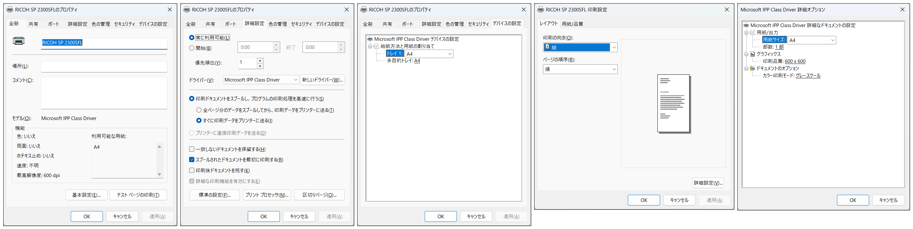

.. _ricoh-sp-2300sfl:

RICOH SP 2300SFL
================

結果
----

2026/01/27 現在、メーカーのセットアップは Windows 11 on Arm には未対応のようです

確認できた機能

* USB 接続での印刷
* USB 接続でのスキャン

※ ほかの接続方法については、未確認です

プリンターのプロパティー
----------------------------------

``Microsoft IPP Class Driver`` です。
白黒 A4 縦 片面印刷 での印刷しか確認していません

テスト印刷したものを、スキャンしました

:download:`imgs/sp-2300sfl/test-page.png`

スキャン
----------------------------------

`Windows スキャン <https://apps.microsoft.com/detail/9wzdncrfj3pv?hl=ja-JP&gl=US>`_ を使用しました。
Windows では WIA (Windows Image Acquisition) 対応デバイスとして認識されるようです。
Mopria eSCL 対応スキャナーを ``IPP over USB`` 経由で認識したものと思われます。
詳細は、わかりません

.. image:: imgs/sp-2300sfl/scan-app.png
