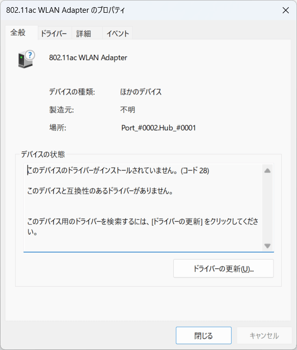

BUFFALO WI-U2-433DHP/N
========================

未対応です。

- `WI-U2-433DHP/N : Wi-Fiアダプター : AirStation | バッファロー <https://www.buffalo.jp/product/detail/wi-u2-433dhp_n.html>`_

.. pull-quote::

    Wi-Fiアダプター 11ac 433/150Mbps USB2.0用 AirStation ハイパワー

``ASUS Vivobook 16 X1607QA`` は Wi-Fi アダプター (``Qualcomm FastConnect 6900 Wi-Fi 6E Dual Band Simultaneous (DBS) WiFiCx Network Adapter``) を内蔵しています。

そのため、こういったデバイスは通常は不要です。

しかし、デバイスの動作確認を Windows 11 Arm でしようと思うと、できません。その点だけ要注意です。

デバイスマネージャーにて:

